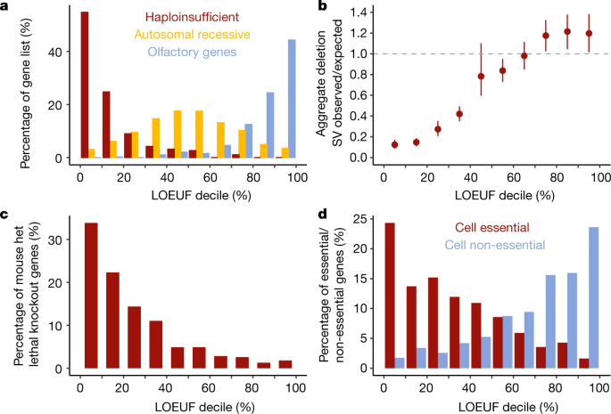
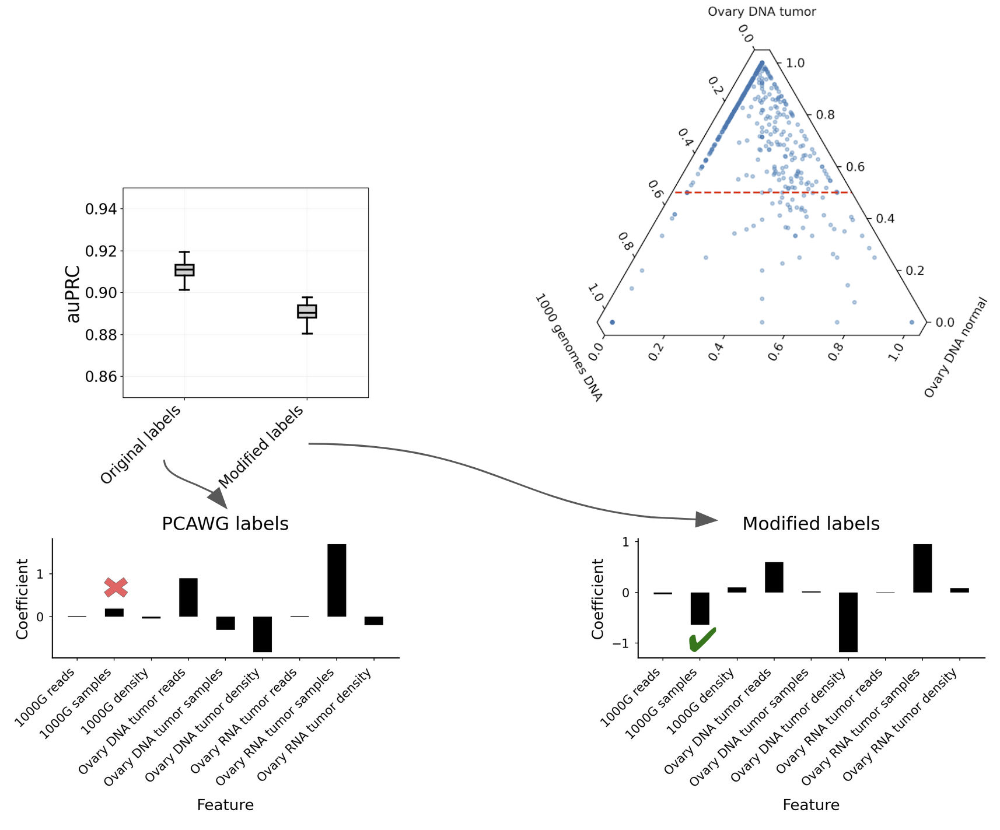
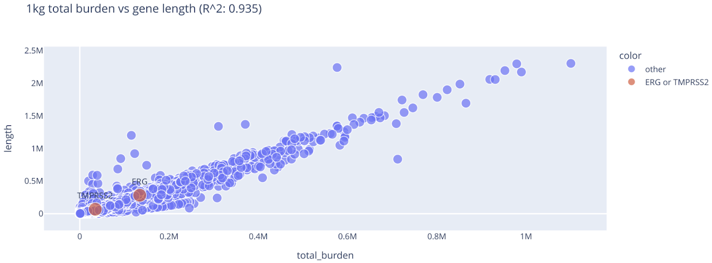
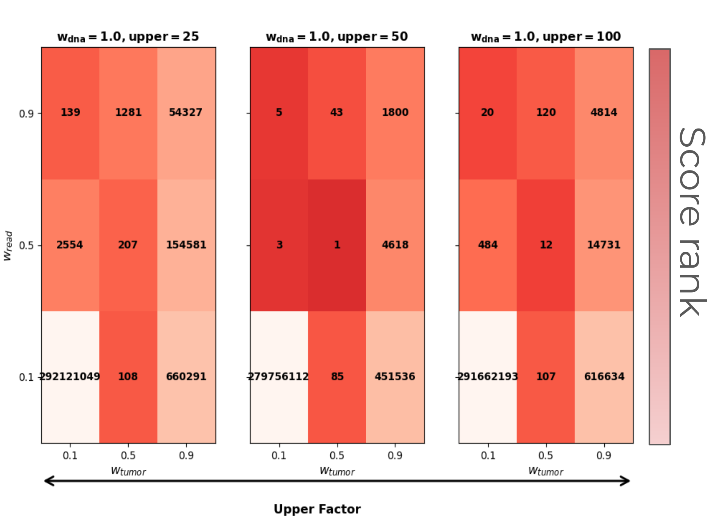
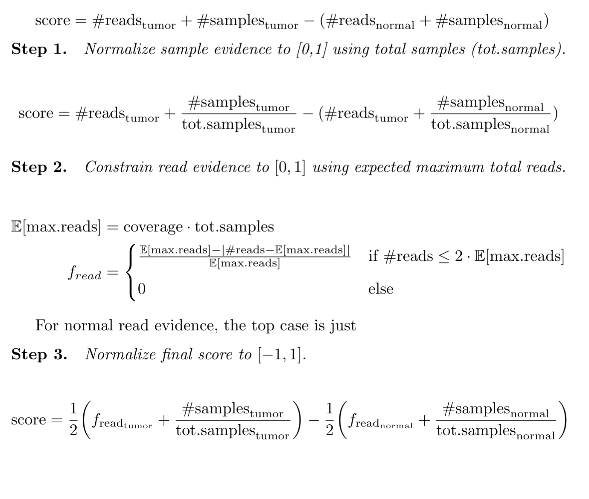
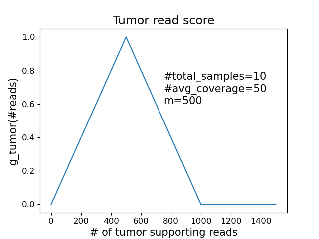
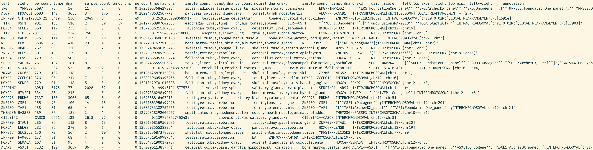

## Outline

- ERG-TMPRSS2 functional equivalence
- ERG-TMPRSS2 maximal score
- Novel fusion discovery
- Score function evaluation
- Benchmark fusions recurrent in normal samples
- Miscelleneous

## ERG-TMPRSS2 functional equivalence

:::: {.columns}

::: {.column width="50%"}
{width="500px" height="400px"}
:::

::: {.column width="50%"}
{width="500px" height="400px"}
:::

::: {.small}
Key point: Recurrent fusion discovery is more sensitive when variable breakpoints are merged into equivalent variants.
:::

::::

## ERG-TMPRSS2 maximal score

{width=80% fig-align="center"}

::: {.small}

Key point: ERG-TMPRSS2 has the highest fusion score because it has abundant tumor read & sample support with minimal normal read & sample support.

:::

## Novel fusion discovery

:::: {.columns}

::: {.column width="50%"}
{width="400px" height="200px"}
:::

::: {.column width="50%"}
{width="400px" height="200px"}
:::

::::

:::: {.columns}
::: {.column width="50%"}
{width="400px" height="200px"}
:::
::: {.column width="50%"}
{width="400px" height="200px"}
:::
::::

## Novel fusion discovery workflow

1. Requirements: i) High score, ii) intrachromosomal
2. Re-query stix tumor indices and find rank samples by evidence
3. Samplot top 3 samples
4. Check Human Protein Atlas tumor expression and literature search

## Novel fusion discovery POLR3GL--LIX1L

{fig-align="center"}

::: {.small}
- Top sample
- POLR3GL has [high expression](https://www.proteinatlas.org/ENSG00000121851-POLR3GL/cancer) in liver cancers
- LIX1L is reported oncogene for liver and other cancers [1](https://pubmed.ncbi.nlm.nih.gov/34221869/), [2](https://pmc.ncbi.nlm.nih.gov/articles/PMC4550850/)

:::

## Score function evaluation

:::: {.columns}

::: {.column width="50%"}

:::

::: {.column width="50%"}
{width=85%}
:::
::::

## PCAWG tissue-wise fusions

:::: {.columns}
::: {.column width="33%"}
{width=80%}
:::
::: {.column width="33%"}
{width=80%}
:::
::: {.column width="33%"}
{width=80%}
:::
::::

:::: {.columns}

::: {.column width=10%}
:::

::: {.column width="40%"}
{width=65%}
:::

::: {.column width="40%"}
{width=65%}
:::

::: {.column width=10%}
:::

::::

::: {.small}
Key point: Full PCAWG fusion callset (recurrent or not) is right-skewed compared to null. However, some calls have abundant normal evidence (left-skewed).
:::

## Benchmark fusions recurrent in normal samples

::::{.columns}
::: {.column width="33%"}

:::
::: {.column width="33%"}

:::
::: {.column width="33%"}

:::
::::

::: {.small}
Key point: Thousands of benchmarks fusions have >100 read depth in onekg. Hundreds remain even after an annotation filter.
:::

## Miscellaneous: machine learning

{fig-align="center"}

::: {.small}
Key points: i) ML evaluation is deceptively high if you downsample a small number of negative test examples. ii) As expected RNA tumor recurrency was the most important predictor. But, model would also positively weight 1000G recurrency unless I modified labels.
:::

## Miscellaneous: burden

{fig-align="center"}

$$
\text{burden}(\text{gene}_i) = \sum_{\text{gene}_j \neq \text{gene}_i} \text{#reads}_{\text{gene}_i,\text{gene}_j}
$$

## Miscellaneous: score function parameter 

{fig-align="center"}

::: {.small}
Key points: i) Equal weighting of tumor/normal and read/sample evidence was optimal combination for maximizing ERG-TMPRSS2 score. ii) Accounting for coverage is important.
:::

## Miscellaneous: score function

:::: {.columns}
::: {.column width="60%"}

:::
::: {.column width="40%"}
{width=70% height=70%}
:::
::::

## Miscellaneous: final output example

{fig-align="center" width=1200px height=450px}

## To-do

- Re-add RNA evidence
- Do score evaluation experiment
- Refine novel fusion discovery search
- Re-evaluate score function on full PCAWG callset (updated function)
- Apply to Anschutz cohort

