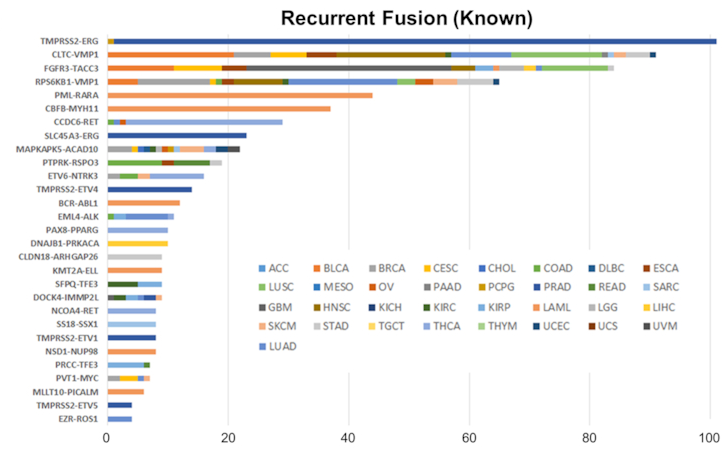
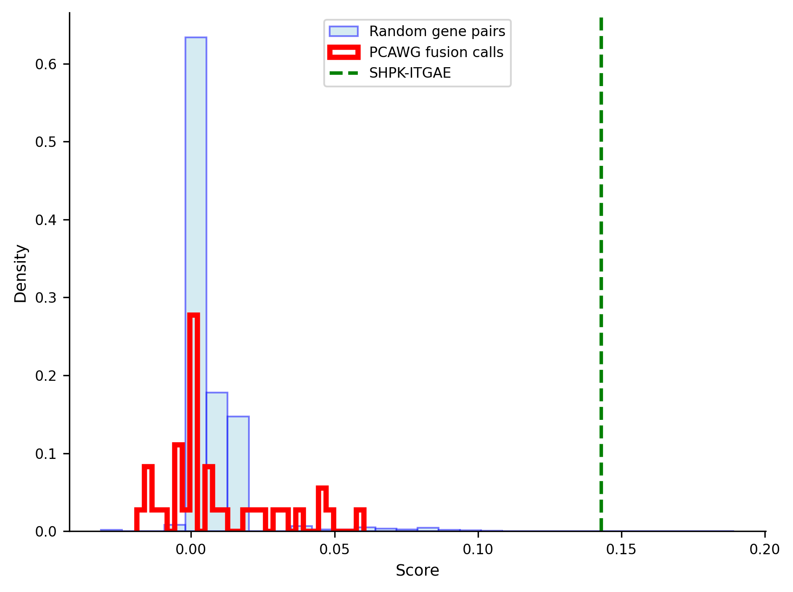

## Population-scale discovery of tumor driving genefusions

 

::: {.center}
Jacob Krol
:::

::: {.center}
Layer lab
:::
{fig-align="center"}

<!-- ## Outline

- Genefusion structural variants (SV)s
- Human genome population databases
- Polymerization: population-scale discovery of tumor driving genefusions
- Evaluation and novel fusion discovery using Polymerization -->

<!-- talk about fusion -->

<!-- :::: {.columns}
::: {.column width="25%"}
{fig-align="center"}
:::
::: {.column width="25%"}
{fig-align="center" width=60%}
:::
::: {.column width="25%"}
{fig-align="center" width=85%}
:::
::: {.column width="25%"}
{fig-align="center"}
:::
:::: -->

## Genefusions

- Genefusions are mutations joining two genes together

{fig-align="center"}

<!-- ::: {.column width="70%"}
{fig-align="center"}
::: -->

## Recurrent tumor fusions

::: {.small}
- In human cancer, some fusions are known to drive tumor progression
- **Recurrent** fusions are potential diagnostic and therapeutic targets
:::

:::: {.columns}

::: {.column width="30%"}
{fig-align="center"}
:::

::: {.column width="70%"}
{fig-align="center"}
:::
::::

:::aside
E.g., ERG-TMPRSS2 is a diagnostic marker, occuring in ~50% of prostate cancer cases
:::

## Genomic interval databases

- Storage and retrieval of fusions across populations is enabled by genomic interval databases (STIX & GIGGLE)

:::: {.columns}
::: {.column width="33%"}
{fig-align="center"}
:::
::: {.column width="33%"}
{fig-align="center"}
:::
::: {.column width="34%"}
{fig-align="center"}
:::
::::

:::aside
STIX & GIGGLE developed by Layer Lab
:::

<!-- ## Problem statement

::: {.small}
- How discover novel recurrent fusions driving human cancer?
- Can population recurrency be used to amplify low fusion signal overlooked by single-sample fusion callers?
:::

:::: {.columns}
::: {.column width="50%"}
{width=70% fig-align="center"}
:::
::: {.column width="50%"}
{width=90% fig-align="center"}
:::
::::
<!-- add star at mean breakpoint -->

<!-- :::{.small}
"Functionally equivalent" variants are necessary to identify recurrency
::: -->

## Adjacent work

::: {.small}
- Large control cohorts are used for *filtering* structural variants (SV)s
:::

:::: {.columns}
::: {.column width="35%"}
:::
::: {.column width="35%"}
{fig-align="center" width=35%}
{fig-align="center" width=35%}
:::
::: {.column width="30%"}
:::
::::

::: aside
Fusions are a special case of SVs
:::

<!-- Population databases for *discovery* of SV-disease-association is underexplored -->

  
## Current approach

::: {.small}
- Here, population databases are used for *discovery* of tumor-driving fusions
:::

{fig-align="center" width=70%}

:::aside
Need a large cancer cohort to find recurrent fusions
:::

## Data

::: {.small}
- Tumor and control (WGS & RNA-seq): 2,143 Pan-cancer Analysis of Whole Genomes (PCAWG) samples
- Control (WGS): 2,504 samples from 1000G project
- Total 4,647 human genome samples
:::

:::: {.columns}
::: {.column width="50%"}
{fig-align="center" width=80%}
:::
::: {.column width="50%"}
{fig-align="center" width=70%}
:::
::::

:::aside
Variability in tissue, sequencing technology, and disease state across samples
:::

## Feasibility enabled by databases

::: {.very-small}
- Competing databases are usually summary statistics
- GIGGLE and STIX retain sample-wise read-level evidence
:::

{fig-align="center" width=30%}

:::: {.columns}
::: {.column width="33%"}
{fig-align="center" width=40%}
:::
::: {.column width="33%"}
{fig-align="center" width=40%}
:::
::: {.column width="34%"}
{fig-align="center" width=40%}
:::
::::

## Fusion prioritization

- How prioritize most likely tumor-driving fusions given the multimodal evidence ($\mathbf{x}$)?

:::: {.columns}
::: {.column width="50%"}
{fig-align="center"}
:::
::: {.column width="50%"}
$$
f(\mathbf{x}) = \text{?}
$$
:::
::::

## Fundamental units of fusion evidence

$$
\text{score} = {\color{skyblue}{\text{#reads}}} + {\color{skyblue}{\text{#samples}}} - \text{#reads} - \text{#samples}
$$

## Normalization

::: {.small}
- Normalization accounts for population size and sequencing parameters (coverage)
:::

:::: {.columns}
::: {.column width="50%"}
{fig-align="center" width=60%}
:::
::: {.column width="50%"}
{fig-align="center" width=80%}
:::
::::

:::: {.columns}
::: {.column width="30%"}
::: {.very-small}
$$
\text{score}_{\text{sample}} \in [0,1] = \frac{\text{#samples}}{\text{Population size}} 
$$
:::
:::

::: {.column width="40%"}
::: {.very-small}
$$
\text{score}_{\text{reads}} \in [0,1] =
\begin{cases}
  \frac{\mathbb{E}[\text{max reads]} - |\text{#reads} - \mathbb{E}[\text{max reads}]|}{\mathbb{E}[\text{max reads}]} & \text{if #reads} \leq 2\cdot \mathbb{E}[\text{max reads}] \\[6pt]
  0 & \text{else}
\end{cases} 
$$
:::
:::

::: {.column width="30%"}

:::
::::

## Score sign interpretation

- score $\in \mathbb{R}_{++} \rightarrow$ [tumor]{style="color: skyblue;"} evidence $>$ normal evidence

$$
\text{score} = \frac{1}{2} ({\color{skyblue}{\text{score}_{\text{reads}}}} + {\color{skyblue}{\text{score}_{\text{samples}}}} - \text{score}_{\text{reads}} - \text{score}_{\text{samples}})
$$

:::aside
$\frac{1}{2}$ scales score to [-1,1] range

Optional mixing parameters: $W_{normal} \in [0,1]$ and $W_{tumor} = 1 - W_{normal}$
:::

## Prostate ERG-TMPRSS2 evaluation

::: {.small}
- Recurrent tumor fusion score is higher than random gene pairs
- PCAWG prostate fusion call (not recurrent) scores are right-skewed
:::

{fig-align="center"}

## Recurrent normal vs. recurrent tumor classification {.small}

- Score threshold separated recurrent tumor fusions from recurrent normal fusions

{fig-align="center" width=35%}

:::: {.columns}
::: {.column width="50%"}
{fig-align="center" width=65%}
:::
::: {.column width="50%"}
{fig-align="center" width=65%}
:::
::::

## Tissue specificity score evaluation

::: {.small}
- Positives scored using "in-tissue" samples
- Negatives scored using "off-tissue" samples
:::

:::: {.columns}
::: {.column width="50%"}
{fig-align="center"}
:::
::: {.column width="50%"}
{fig-align="center"}
:::
::::

## Novel fusion discovery

::: {.small}
- Discovered a potential novel fusion in kidney cancer: SHPK--ITGAE
:::

:::: {.columns}
::: {.column width="50%"}
{width=80% fig-align="center"}
:::
::: {.column width="50%"}
{fig-align="center"}
:::
::::

<!-- ## Results

::: {.small}
Benchmark study called 59,117 fusions in cancer cell lines using 23 different methods
:::

{fig-align="center" width=25%}

:::: {.columns}
::: {.column width="33%"}
{fig-align="center" width=80%}
:::
::: {.column width="33%"}
{fig-align="center" width=80%}
:::
::: {.column width="34%"}
{fig-align="center" width=80%}
:::
::::

::: {.small}
Large normal cohort (data-driven) filtering supplements annotation (gene name) filtering
::: -->

## Conclusions

::: {.small}
- Developed a fusion ranking metric for population-scale data
- Evaluation
  - Separation of recurrent tumor and normal fusions
  - Tissue specificity
- Potential novel fusion discovery: SHPK--ITGAE in kidney cancer
  - Not reported in primary PCAWG publication
:::

:::: {.columns}
::: {.column width="33%"}
{fig-align="center" width=70%}
::: 
::: {.column width="33%"}
{fig-align="center" width=70%}
:::
::: {.column width="34%"}
{fig-align="center" width=90%}
:::
::::

## Next steps

::: {.small}
- Potential collaboration with Anschutz Children's hospital
- Further visual verification 
  - Multiple samples
- Add probabilistic score interpretation
:::

:::: {.columns}
::: {.column width="50%"}
{fig-align="center" width=80%}
:::
::: {.column width="50%"}
{fig-align="center" width=80%}
:::
::::

## Acknowledgements

- Ryan Layer, Ph.D. 
- Murad Chowdhury
- Ben Braun
- Simon Walker
- Anton Avramov, Ph.D.
- Eric Johnson, Ph.D.
- Funding: NIH 5R01HG011774-04

## References

- Publication and figure refernces
  - https://github.com/jakekrol/genefusion/blob/main/docs/2026_04-dbmi-symposium.qmd

<!-- 
- SV calling long and short of it
  - [Mahmoud, M., Gobet, N., Cruz-Dávalos, D.I. et al. Structural variant calling: the long and the short of it. Genome Biol 20, 246 (2019). https://doi.org/10.1186/s13059-019-1828-7]
- Genefusion simple diagram 
  - [Cmero, M., Schmidt, B., Majewski, I.J. et al. MINTIE: identifying novel structural and splice variants in transcriptomes using RNA-seq data. Genome Biol 22, 296 (2021). https://doi.org/10.1186/s13059-021-02507-8]
- Genefusion mechanism diagram
  - [Giovanna Dashi, Markku Varjosalo, Oncofusions – shaping cancer care, The Oncologist, Volume 30, Issue 1, January 2025, oyae126, https://doi.org/10.1093/oncolo/oyae126]
- ChimerDB
  - [Ye Eun Jang, Insu Jang, Sunkyu Kim, Subin Cho, Daehan Kim, Keonwoo Kim, Jaewon Kim, Jimin Hwang, Sangok Kim, Jaesang Kim, Jaewoo Kang, Byungwook Lee, Sanghyuk Lee, ChimerDB 4.0: an updated and expanded database of fusion genes, Nucleic Acids Research, Volume 48, Issue D1, 08 January 2020, Pages D817–D824, https://doi.org/10.1093/nar/gkz1013] -->

## Notes

- Text -> Header
- Ask for extension
- omit equivalent experiment
- slide with gap
- transition from fusion background to population databases
  - stix plus DB
- Use baby fusion photo and recurrency
  - order: fusion -> recurrency importance -> population databases (cohort + database icon)
- adjust text on previous work slide
- replace sample count bar with PCAWG icon
- Crime scene analogy after data
  - after, pose question of how to do it
- erg-tmprss2 evaluation:
  - "How is it doing?"
  - Point out ET2 is well-known fusions
- roc bigger
- remove the pcawg heatmap and just talk about it

** in general, text -> header**
- center format other text

