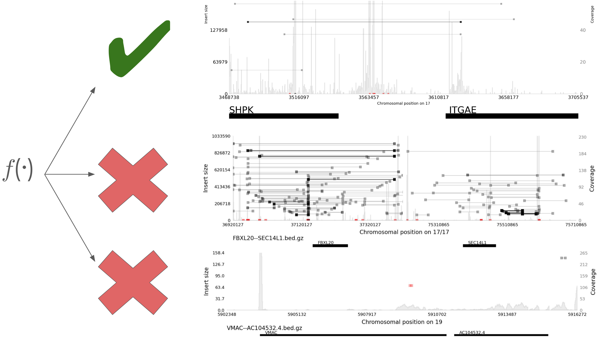

## Fusions

 

{fig-align="center"}

## Visually prioritizing gene fusions

{fig-align="center" width=80%}

## Skills

::: {.small}

:::: {.columns}
::: {.column width="50%"}
- **Sequence analysis**
    - Sequence file formats and processing tools
- **Data visualization**
    - Matplotlib
- **Statistics**
    - Develop fusion prioritization model
:::
::: {.column width="50%"}
- **Programming**
    - Python and Bash
- **Version control**
    - Git
:::
::::

:::
