## Gene fusions

 

{fig-align="center"}

## Tumor-driving fusions

::: {.center}
**Recurrent** fusions can drive tumor progression
:::

{fig-align="center" width=5%}

## Differential recurrency

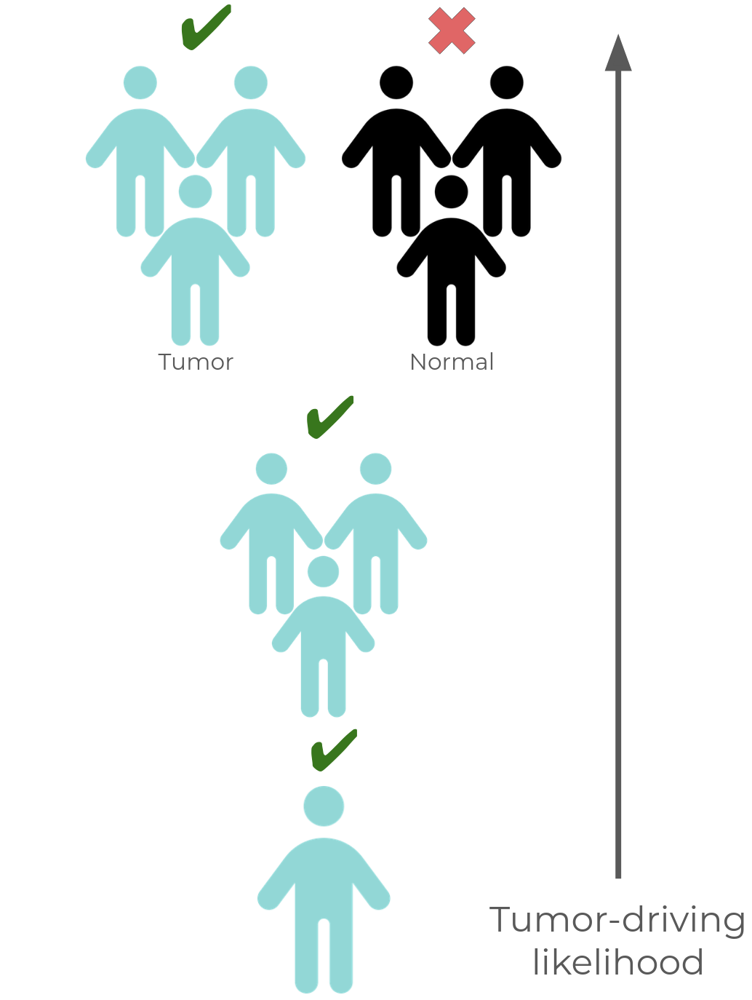{fig-align="center" width=70%}

## Multi-sample calling gap

  

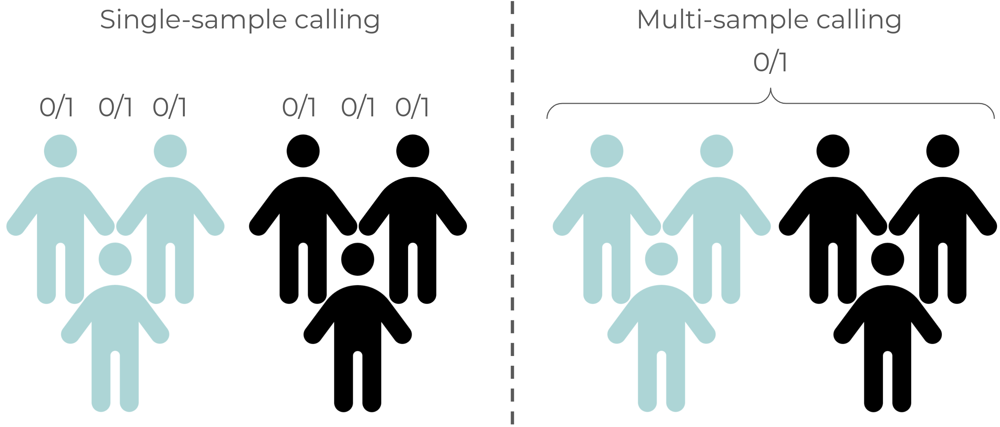{fig-align="center" width=70%}

## Tumor heterogeneity

::: {.center}
Low fusion signal
:::

 

:::: {.columns}
::: {.column width="10%"}
:::
::: {.column width="40%"}
::: {.center}
{fig-align="center" width=50%}
:::
:::
::: {.column width="40%"}
{fig-align="center" width=30%}
:::
::: {.column width="10%"}
:::
::::

## Multiple samples increase sensitivity

::: {.center}
High aggregate fusion signal
:::

 

:::: {.columns}
::: {.column width="25%"}
::: {.center}
{fig-align="center" width=65%}
:::
:::
::: {.column width="25%"}
{fig-align="center" width=30%}
:::
::: {.column width="25%"}
::: {.center}
{fig-align="center" width=80%}
:::
:::
::: {.column width="25%"}
{fig-align="center"}
:::
::::

## Multiple samples increase specificity

::: {.center}
Ignore fusions with high normal signal
:::

 

:::: {.columns}
::: {.column width="25%"}
::: {.center}
{fig-align="center" width=65%}
:::
:::
::: {.column width="25%"}
{fig-align="center" width=30%}
:::
::: {.column width="25%"}
::: {.center}
{fig-align="center" width=80%}
:::
:::
::: {.column width="25%"}
{fig-align="center"}
:::
::::

<!-- ## Leveraging corroborating evidence

{fig-align="center" width=40%} -->

## Single-sample depth dependence

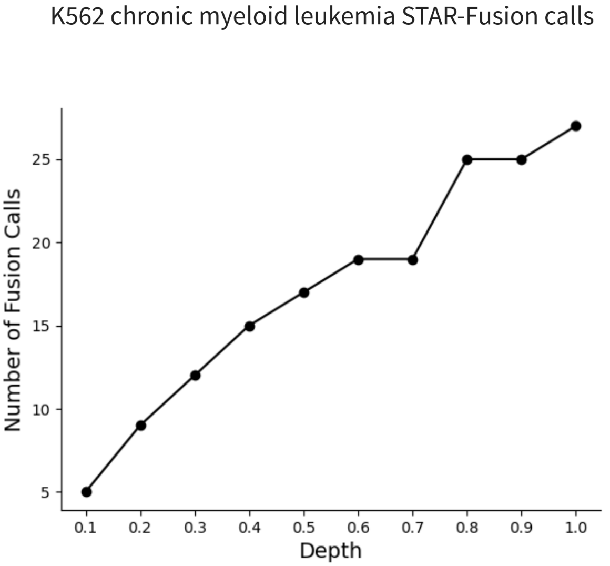{fig-align="center" width=70%}

## Population fusion dataset

::: {.center}
4,647 total human genome samples
:::

{fig-align="center" width=70%}

## Sample heterogeneity

{fig-align="center" width=70%}

## Fusion prioritization

<!-- - **Polymerization** score ranks fusions given multimodal data -->

 

:::: {.columns}
::: {.column width="33%"}

{fig-align="center" width=80%}
:::
::: {.column width="66%"}
{fig-align="center" width=100%}
:::
::::

:::{.center}
:::{.small}
$$
\text{score} \approx \text{#reads}_{\text{tumor}} + \text{#samples}_{\text{tumor}} - \text{#reads}_{\text{normal}} - \text{#samples}_{\text{normal}}
$$
:::
:::

## Score prioritization evaluation

<!-- ::: {.small}
- Recurrent tumor fusion score is higher than random gene pairs
- PCAWG prostate fusion call (not recurrent) scores are right-skewed
::: -->

  

:::{.center}
Prostate
:::

<!-- {fig-align="center"} -->

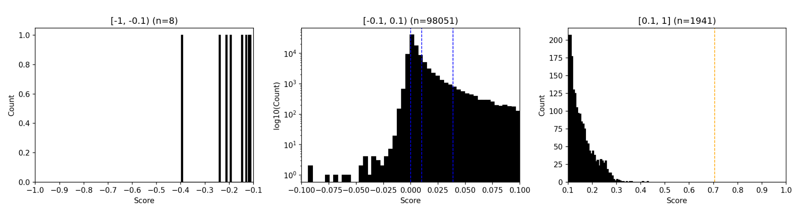{fig-align="center" width=70%}

## Recurrent normal vs. tumor classification

:::: {.columns}

::: {.column width="60%"}

:::
::: {.column width="40%"}
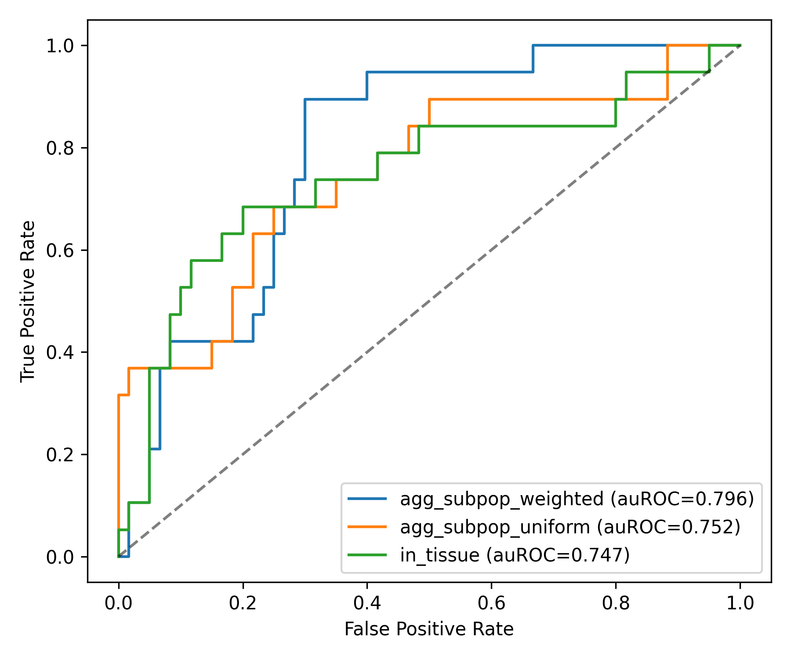{fig-align="center"}
:::
::::

## Inspecting tumor and normal scores

:::{.small}
:::{.center}
Tumor confidence order: ChimerKB > ChimerPub > ChimerSeq
:::
:::

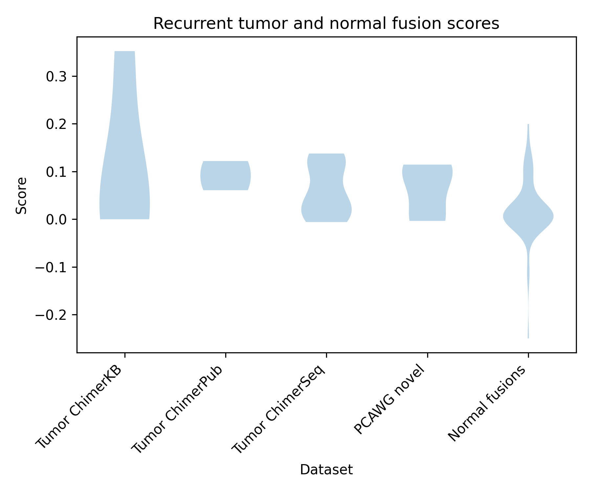{fig-align="center" width=50%}

## Tissue dependence

:::{.center}
:::{.small}
Prostate
:::
:::

:::{.aside}
:::{.center}
Directly comparing scores across tissues is not a good idea; p-value is more informative
:::
:::

{fig-align="center" width=50%}

:::{.small}
:::{.center}
Blood
:::
:::

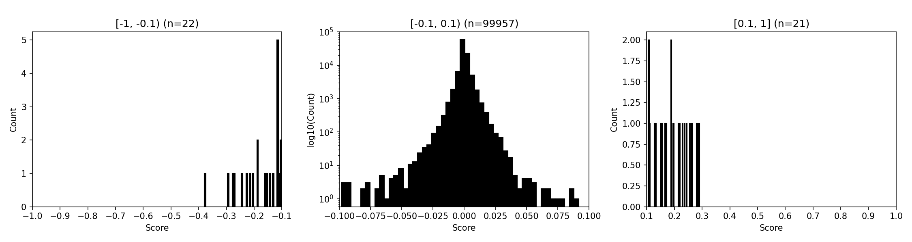{fig-align="center" width=50%}

## Recurrent tissue classification

:::: {.columns}
::: {.column width="40%"}
 
{fig-align="center"}
:::
::: {.column width="60%"}
:::{.center}
{fig-align="center" width=80%}
:::
:::
::::

## Tissue specificity score evaluation

:::: {.columns}
::: {.column width="60%"}
 
{fig-align="center"}
:::
::: {.column width="40%"}
 
{fig-align="center"}
:::
::::

## Fusion discovery attemps

<!-- {fig-align="center" width=40%} -->

{fig-align="center" width=50%}

<!-- :::: {.columns}
::: {.column width="50%"}
{width=80% fig-align="center"}
:::
::: {.column width="50%"}
{fig-align="center"}
:::
:::: -->

:::{.center}
:::{.small}
Is SHPK-ITGAE a recurrent fusion?
:::
:::

## SHPK-ITGAE recurrency

 

:::{.center}
Recurrent, but not tumor driving
:::

 

| # Tumor samples | # Normal Samples | 
| --- | --- |
| 20 samplots | 11 samplots | 

## Confounders of discovery

 

:::{.center}
:::{.small}
High coverage regions
:::
:::

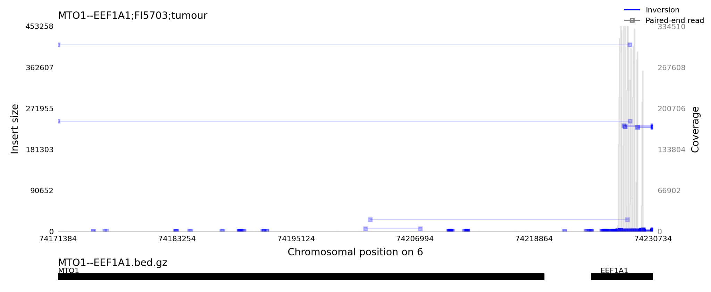{fig-align="center" width=70%}

## Confounders of discovery

::: {.center}
:::{.small}
Highly expressed genes
:::
:::

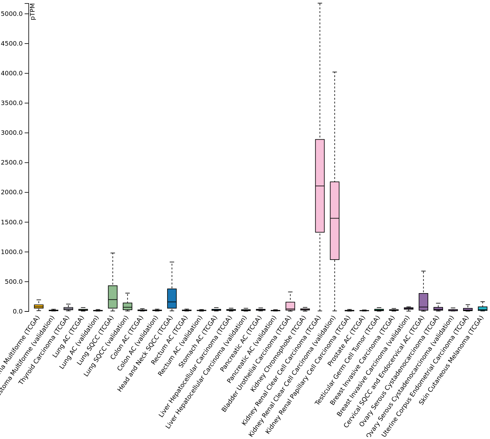{fig-align="center" width=30%}

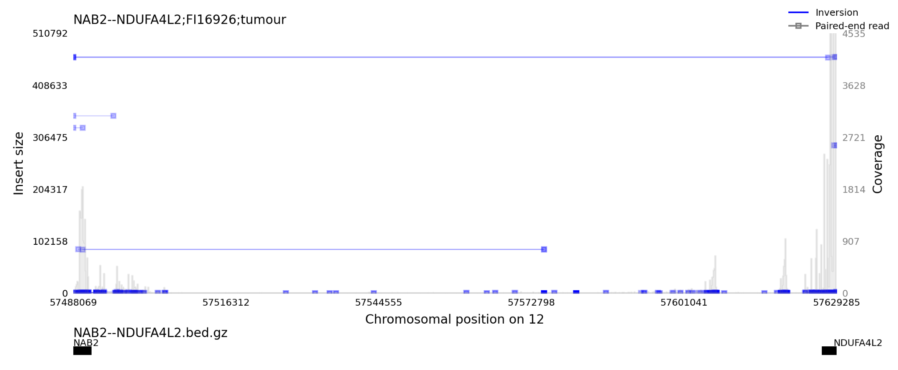{fig-align="center" width=40%}

## Confounders of discovery

 

:::{.center}
:::{.small}
Inversion noise
:::
:::

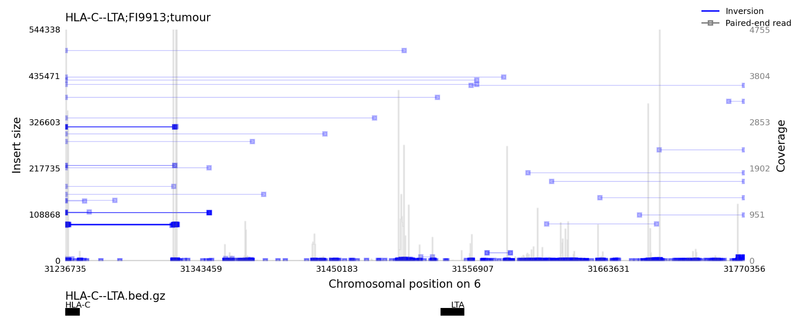{fig-align="center" width=70%}

## Exemplary samplot fusions

 

:::{.small}
:::{.center}
Lung cancer (LC2AD) fusion
:::
:::

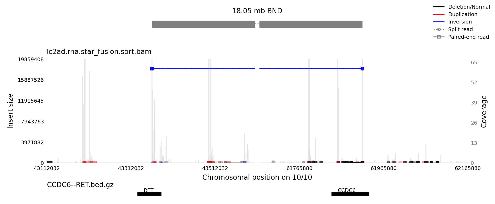{fig-align="center" width=40%}

## Discovery challenges

1. High coverage confounders
2. Normal fusions are insufficiently penalized by score

{fig-align="center" width=70%}

## Discovery refinement process

:::{.small}
:::{.center}
- Prioritize fusions with high partner fraction (STAR-Fusion inspired)

$$
\text{partner_fraction}(x,y) = \frac{\text{#fusion reads}_{xy}}{\text{#fusion reads}_x} > 0.2
$$

- Guided alignment verification (FusionInspector; input is FASTQ)
:::
:::

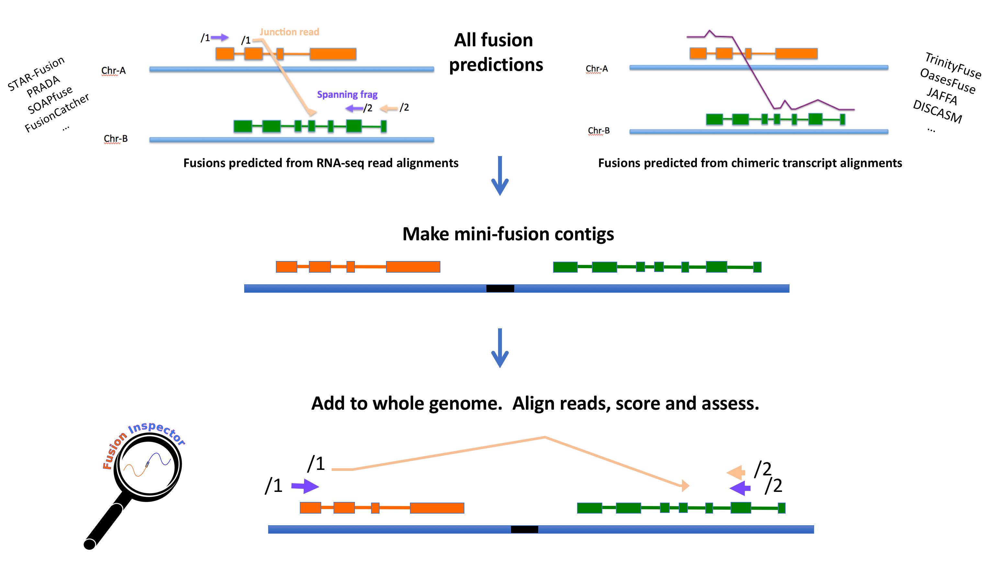{fig-align="center" width=70%}

## 1000G RNA problems

 

:::{.small}
:::{.center}
STAR-Fusion calls on 1000G RNA sample
:::

| #FusionName | JunctionReadCount | SpanningFragCount |
| --- | --- | --- |
| TIMM23--PARGP1 | 95 | 16 |
| TIMM23--RP11-574K11.29 | 34 | 7 |
| ... | ... | ... |
:::

 

:::{.small}
:::{.center}
Excord finds 0 fusion reads from BAM of same sample.
:::
:::

## Next steps

 

:::{.center}
:::{.small}
How to narrow search space by orders of magnitude?
:::
:::

{fig-align="center" width=70%}

## Next steps

:::{.center}
:::{.small}
What can be learned from well-studied fusions?
:::

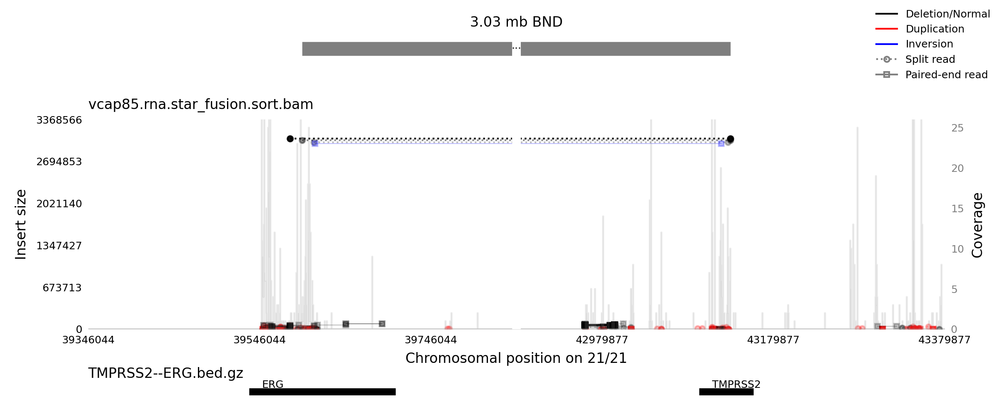{fig-align="center" width=40%}

{fig-align="center" width=40%}
<!-- 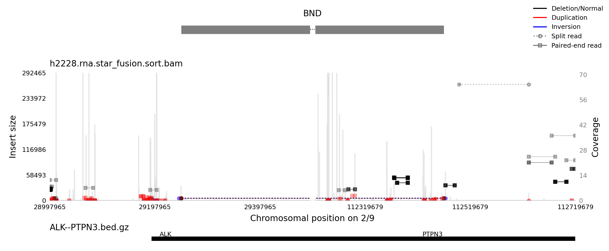{fig-align="center" width=40%} -->

:::

## Breakpoint awareness

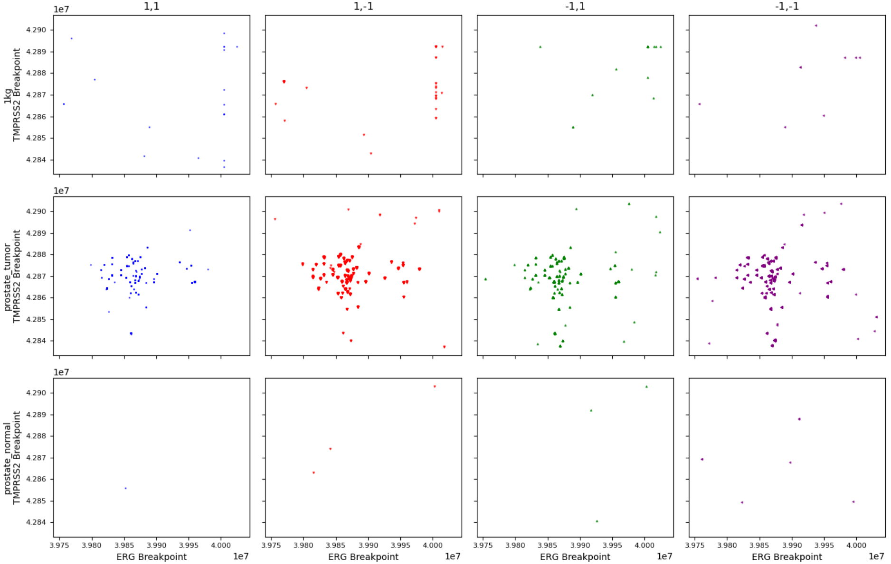{fig-align="center" width=70%}

## Breakpoint awareness

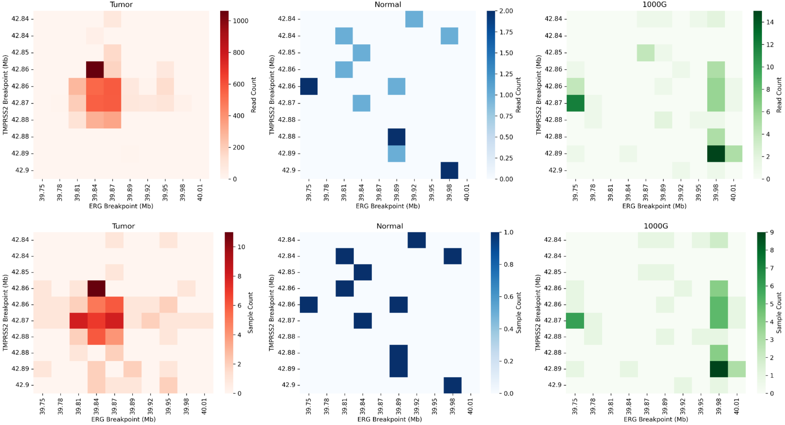{fig-align="center" width=70%}

<!-- ## Discovery potential

{fig-align="center" width=80%} -->

## Filtering with control cohort

::: {.center}
- 59,117 benchmark cancer cell line fusions
:::

:::: {.columns}
::: {.column width="50%"}
{fig-align="center" width=100%}
:::
::: {.column width="50%"}
{fig-align="center" width=100%}
:::
::::

<!-- :::: {.columns}
::: {.column width="33%"}
{fig-align="center" width=80%}
:::
::: {.column width="33%"}
:::
::: {.column width="34%"}
{fig-align="center" width=80%}
:::
:::: -->

## Appendix

## Data

::: {.small}
- Tumor and control (WGS & RNA-seq): 2,143 Pan-cancer Analysis of Whole Genomes (PCAWG) samples
- Control (WGS): 2,504 samples from 1000G project
- Total 4,647 human genome samples
:::

:::: {.columns}
::: {.column width="50%"}
{fig-align="center" width=80%}
:::
::: {.column width="50%"}
{fig-align="center" width=70%}
:::
::::

:::aside
Variability in tissue, sequencing technology, and disease state across samples
:::

## Read-level resolution

- Read-level fusion evidence is stored for each sample

:::: {.columns}
::: {.column width="33%"}
{fig-align="center" width=55%}
{fig-align="center" width=55%}
:::
::: {.column width="66%"}

 

{fig-align="center" width=100%}
:::
::::

## Fundamental units of fusion evidence

$$
\text{score} = {\color{skyblue}{\text{#reads}}} + {\color{skyblue}{\text{#samples}}} - \text{#reads} - \text{#samples}
$$

## Normalization

::: {.small}
- Normalization accounts for population size and sequencing parameters (coverage)
:::

:::: {.columns}
::: {.column width="50%"}
{fig-align="center" width=60%}
:::
::: {.column width="50%"}
{fig-align="center" width=80%}
:::
::::

:::: {.columns}
::: {.column width="40%"}
::: {.very-small}
$$
\text{score}_{\text{sample}} \in [0,1] = \frac{\text{#samples}}{\text{Population size}} 
$$
:::
:::

::: {.column width="40%"}
::: {.very-small}
$$
\text{score}_{\text{reads}} \in [0,1] =
\begin{cases}
  \frac{\mathbb{E}[\text{max reads]} - |\text{#reads} - \mathbb{E}[\text{max reads}]|}{\mathbb{E}[\text{max reads}]} & \text{if #reads} \leq 2\cdot \mathbb{E}[\text{max reads}] \\[6pt]
  0 & \text{else}
\end{cases} 
$$
:::
:::

::: {.column width="30%"}

:::
::::

## Blood score distribution

 

{fig-align="center" width=70%}

## Bone score distribution

 

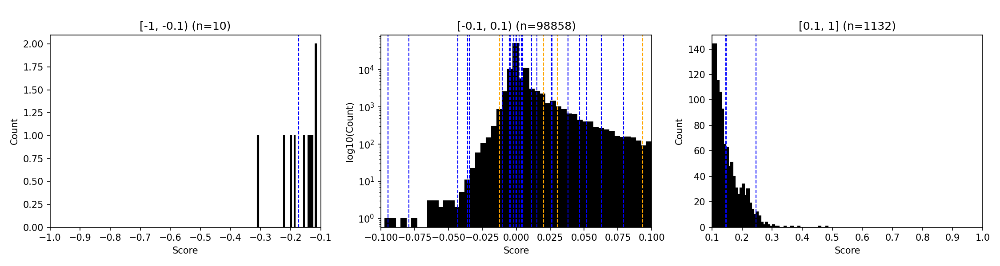{fig-align="center" width=70%}

## Breast score distribution

 

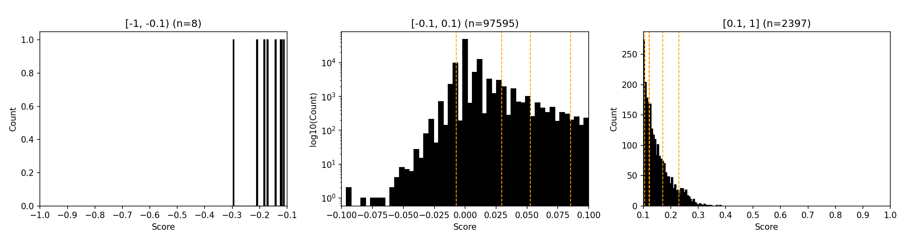{fig-align="center" width=70%}

## Esophagus score distribution

 

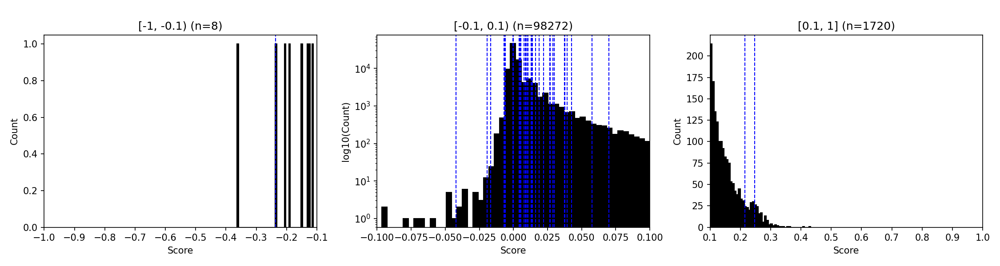{fig-align="center" width=70%}

## Gallbladder score distribution

 

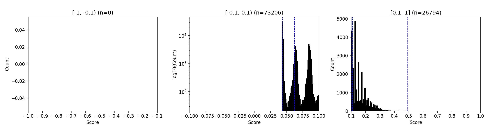{fig-align="center" width=70%}

## Headneck score distribution

 

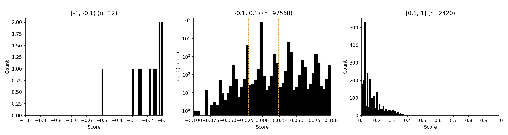{fig-align="center" width=70%}

## Kidney score distribution

 

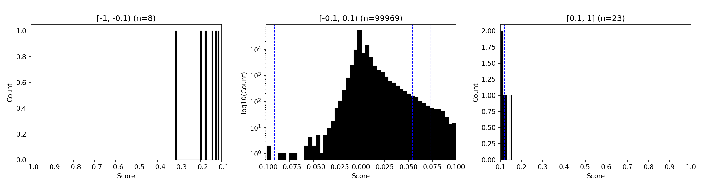{fig-align="center" width=70%}

## Liver score distribution

 

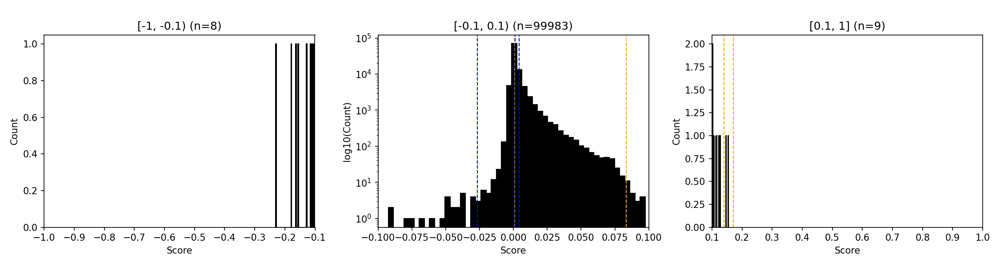{fig-align="center" width=70%}

## Ovary score distribution

 

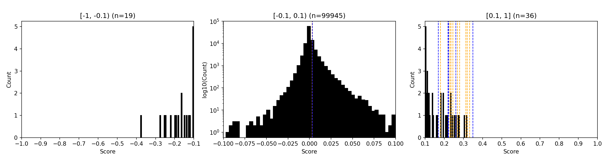{fig-align="center" width=70%}

## Pancreas score distribution

 

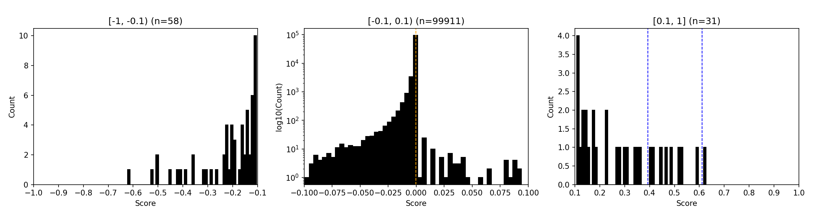{fig-align="center" width=70%}

## Prostate score distribution

 

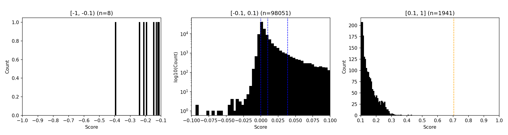{fig-align="center" width=70%}

## Sample heterogeneity

{fig-align="center" width=70%}

<!-- ## Single-sample caller low depth

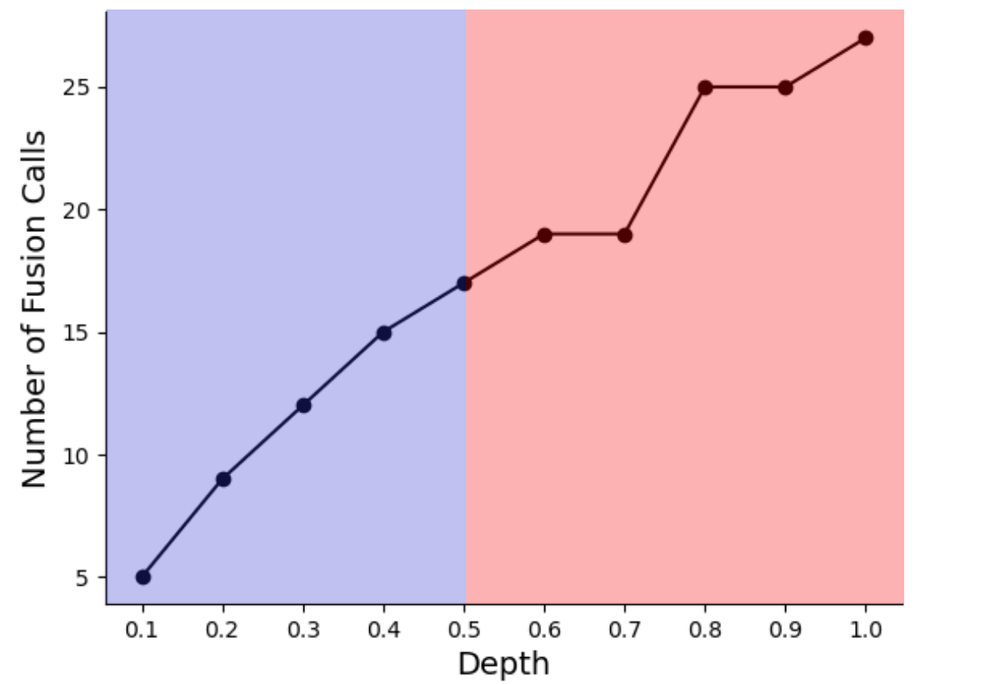{fig-align="center" width=70%} -->

<!-- ## Tissue dependence

::::{.columns}
::: {.column width="80%"}
{fig-align="center" width=70%}
{fig-align="center" width=70%}
{fig-align="center" width=70%}
:::
::: {.column width="20%"}

:::{.center}
 
Liver

 
 

Ovary

 
 

Prostate
:::

:::
:::: -->